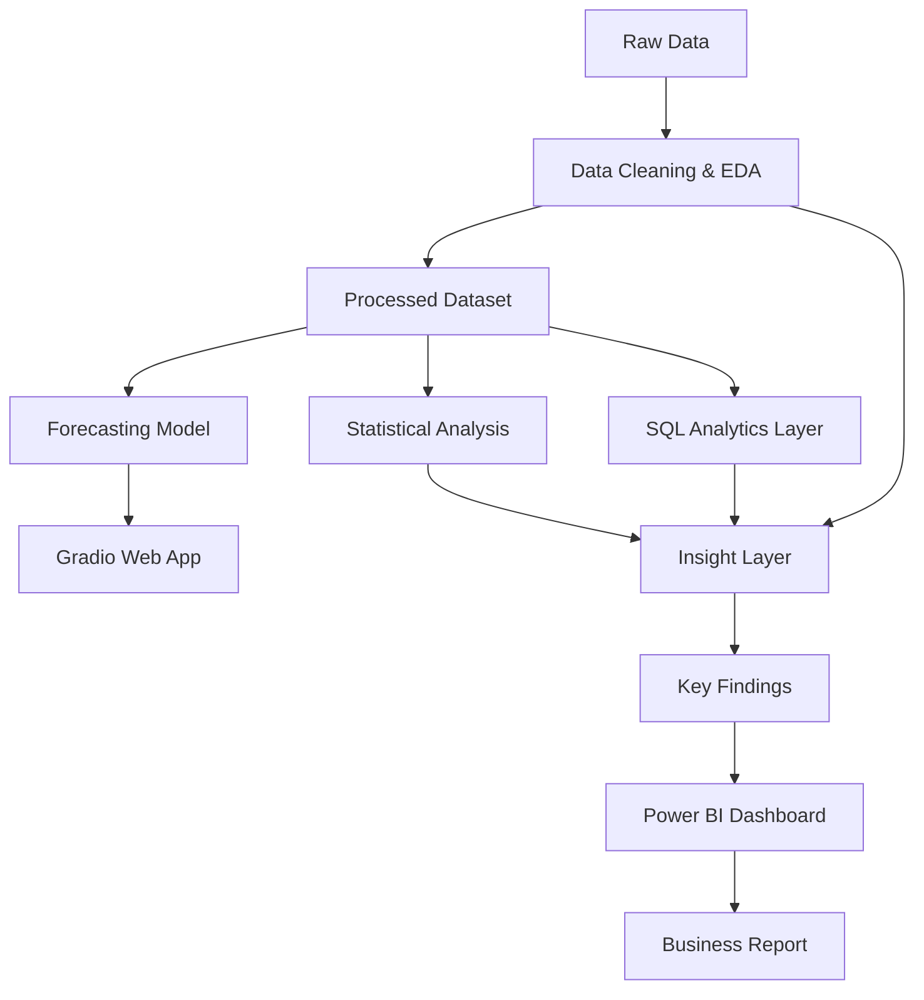
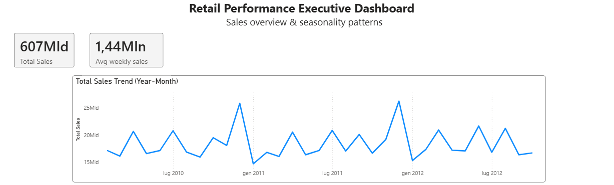
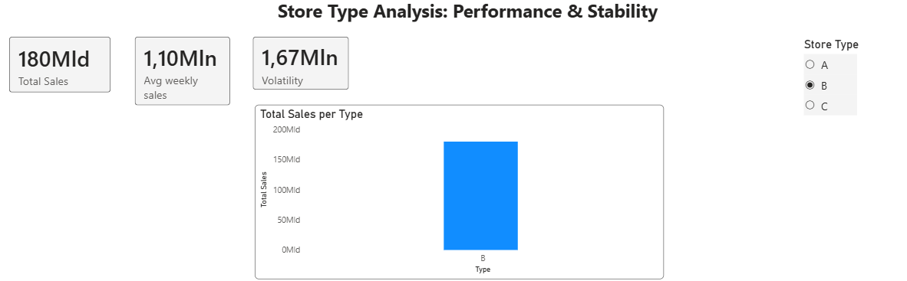
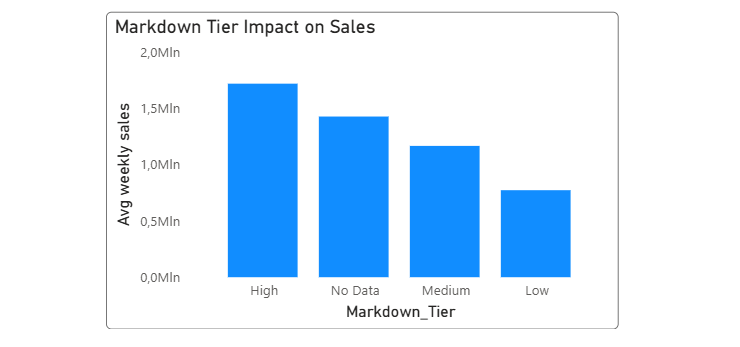

# Walmart Retail Analytics & Weekly Sales Forecasting System

An end-to-end data science and analytics project that:
- includes an interactive web application
- processes retail sales data -> performs a structural and a statistical analysis
- builds forecasting models for weekly demand
- provides interactive business intelligence dashboards for insights and decision-making

---

## 📚 Table of Contents

1. [Executive Business Insights](#-executive-business-insights)  
2. [System Architecture - Data Pipeline](#-system-architecture---data-pipeline)  
3. [Component Breakdown](#component---breakdown)  
   - [Data Engineering, ETL & EDA](#1-data-engineering-etl--eda)  
   - [SQL Analytics](#2-sql-analytics)  
   - [Statistical Analysis Framework](#3-statistical-analysis-framework)  
   - [Forecasting](#4-forecasting)  
   - [Interactive Forecasting App](#5--interactive-forecasting-app-gradio--hugging-face-spaces)  
   - [Business Intelligence Dashboard](#6--business-intelligence-dashboard)  
   - [Dashboard Preview](#7-dashboard-preview)  
4. [Quick Start & Installation](#-quick-start--installation)
   - [Prerequisites](#1-prerequisites)
   - [Environment Setup](#2-environment-setup)
   - [Dependencies Installation](#3-dependencies-installation)
   - [Run the Forecasting Web Application](#4-run-the-forecasting-web-application)
   - [Database Setup (Optional)](#5-database-setup-optional)

---

## 📌 Executive Business Insights

The analysis of the historical retail dataset reveals five key structural patterns in sales behavior.:
* **The Scale Concentration Effect**: sales are highly concentrated; the top 10 stores (led by Store 20, 4, 14, and 13) generate **39.05% of the total revenue** across the network.
* **The Q4 Dominance**: seasonality represents the most critical demand driver, sales remain stable throughout the baseline months but experience a massive surge in late November and December (Q4), followed by a sharp post-holiday contraction in January.
* **The Holiday Variance Amplifier**: Welch's t-test proves that holiday weeks are associated with statistically significant differences in sales levels ($p < 0.001$). However, the effect size is extremely small (**Cohen's d ≈ 0.05**). Holidays act as **demand variance amplifiers** (triggering outliers) rather than shifts in the overall baseline demand.
* **Store Classification & Stability**: grouping stores by Sales Volume and Volatility (standard deviation of weekly aggregate sales) reveals that top-performing stores fall mostly into the **High Sales + Low Volatility** quadrant, demonstrating that revenue maximization is structurally linked to operational stability.
* **Macroeconomic Invariance**: macroeconomic variables (CPI, Unemployment, Fuel Prices, and Temperature) exhibit statistically detectable correlation with sales, but their overall explanatory power is secondary compared to seasonal waves and internal store attributes.

---

## 📈 System Architecture - Data Pipeline

The project follows an end-to-end pipeline from raw data ingestion to business intelligence and model deployment.



---

## Component - Breakdown

### 1. Data Engineering, ETL & EDA
This data pipeline transforms raw retail datasets into a unified, analysis-ready structure suitable for statistical modeling, forecasting, and business intelligence.

#### Multi-source data ingestion
The system integrates three core data sources:

- **Sales core data (`train.csv`)**: weekly sales aggregated by store and department  
- **Macro-economic context (`features.csv`)**: CPI, unemployment, fuel price, temperature, and promotional markdown variables  
- **Store metadata (`stores.csv`)**: store type (A, B, C) and physical size  

#### Data integration & cleaning
- Datasets are merged using sequential **left joins** on Store and Date to preserve all sales records while enriching them with contextual variables.
- Markdown variables (MarkDown1–5) -> high missingness (≈64%–74%), missing values are imputed with 0, preserving natural sales distribution.

### EDA
Key visualizations:

- **Sales distribution** shows strong right skew with extreme outliers.
- **Time-series plots** to analyze weekly sales trends and identify strong seasonal patterns (the Q4 peak and post-holiday decline).
- **Boxplots** comparing holiday vs non-holiday sales distributions, highlighting similar medians but significantly higher outliers during holiday periods.
- **DataFrame-Table** to identify the contribution of the top 10 performing stores and the holiday lift effect for the departments.
- **Bar plots* showing holiday effect by store and department, sales concentration across top-performing departments.
- **Scatter plots** exploring relationships between sales and macroeconomic variables such as CPI, and unemployment.

#### Feature engineering
Temporal variables are explicitly extracted from the Date column:

- Year -> long-term trends  
- Month -> seasonality effects  
- Week (ISO week number) -> weekly cycles  
- Weekday -> intra-week patterns  
- Weekend flag -> segmentation

#### Exported analytical dataset
The final cleaned dataset is exported as a unified source of truth (`final_df.csv`) for statistical analysis and forecasting models.

---

#### Dimensional modeling & data warehousing

To support scalable analytics, the dataset is transformed into a **star schema**:

- **dim_store**: store_id, store_type, size  
- **dim_date**: date_id, year, month, week, weekday, is_weekend  
- **fact_sales**: transactional sales with macroeconomic and promotional features  

The relational structure is loaded into a PostgreSQL database (`walmart_db`) using SQLAlchemy and psycopg2.

---

### 2. SQL Analytics
A relational analytical layer is built using a star schema design.

- Fact table: sales transactions  
- Dimensions: stores and time  

Key analytical views (queries) include:
- Store stability and efficiency ranking
- Volatility vs revenue segmentation
- Promotional intensity analysis across tiers

---

### 3. Statistical Analysis Framework
A set of statistical tests and econometric models are applied to better understand sales drivers.

- **Welch’s t-test** confirms a statistically significant difference between holiday and non-holiday sales, although effect size remains negligible (**Cohen’s d ≈ 0.05**).
- **ANOVA tests** reveal structural differences across store types.
- **OLS regression (statsmodels)** -> store size is great strctural driver, seasonality plays a major role (with Q4 effects being the strongest predictor of weekly sales variation and a significant drop during summer months), macroeconomic variables have a constant negative effect on sales.

---

### 4. Forecasting
A time-series forecasting model is built using Facebook Prophet.

- Captures weekly, yearly, and holiday-based seasonality.
- Selected for its robustness in retail demand forecasting.
- The trained model is saved for deployment in a web application (using Gradio and Hugging Face Spaces).

---

### 5. 🤖 Interactive Forecasting App (Gradio + Hugging Face Spaces)

The trained forecasting model is deployed as an interactive Gradio application and hosted on Hugging Face Spaces.  
It allows users to generate weekly retail sales forecasts (values & plots) dynamically by selecting a prediction horizon.

👉 **Live Demo:** https://huggingface.co/spaces/GabMoyzan/_Walmart_Weekly_Sales_Forecasting_App


### 6. 📊 Business Intelligence Dashboard
An interactive Power BI dashboard provides executive-level insights and seasonality, store performance and sales drivers.

👉 [View Power BI Dashboard](https://app.powerbi.com/view?r=eyJrIjoiNDJkYmU1NGMtYTFlMS00NDlmLTgyNjgtMGFjOGY1ZTVjOGU5IiwidCI6IjI2YjA4ZWFjLTU2ZmEtNDhjOC05NWQ0LTMwOWJhMWZiOGFlMSJ9)

### 7. Dashboard Preview







---

## 🚀 Quick Start & Installation

---

### 1. Prerequisites
Ensure you have **Python 3.10+** installed on your system.

### 2. Environment Setup
Clone or navigate to the project directory and create a virtual environment:
```powershell
# Create a virtual environment
python -m venv venv
# Activate the virtual environment
.\venv\Scripts\Activate
```
### 3. Dependencies Installation
Install the required packages:
```powershell
pip install -r requirements.txt
```
*(Note: Prophet requires some compiled libraries -  on Windows, Anaconda is recommended if you encounter compiler warnings during installation).*

### 4. Run the Forecasting Web Application
Run the Gradio server:
```powershell
python gradio_app.py
```
After executing, the server will launch a local link (typically `http://127.0.0.1:7860`) in your console. Open this address in your browser to interact with the dashboard.

### 5. Database Setup (Optional)
To setup the relational analytical data warehouse locally:
1. Initialize a PostgreSQL instance.
2. Create a database named `walmart_sales`.
3. Import the schema definition:
   ```bash
   psql -U username -d walmart_sales -f sql/schema.sql
   ```
4. Run analytical scripts inside [queries.sql](file:///c:/Users/Windows10/Desktop/sales-forecasting-system/sql/queries.sql) to extract retail insights.