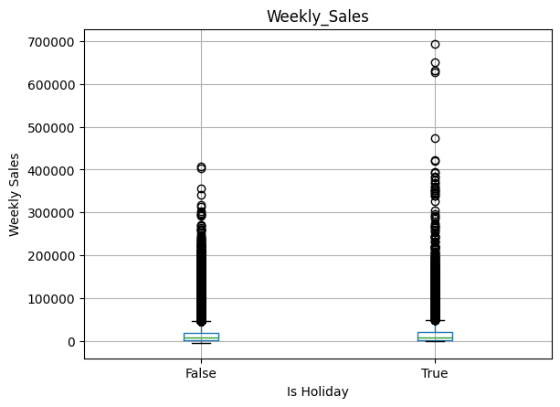

# 📊 Retail Walmart Sales Analysis – Business Report

---

# 📌 Table of Contents

1. Executive Summary  
2. What Drives Sales Performance  
3. Seasonality and Demand Patterns  
4. Impact of Holidays on Sales  
5. Promotions and Sales Performance  
6. Business Resilience 
7. Recommendations  
8. Limitations  
9. Power BI Dashboard

---

## Executive Summary

This analysis aimed to understand the factors shaping weekly retail sales performance across stores (and departments), identify recurring demand patterns, and translate analytical findings into actionable business recommendations.

Five key conclusions:

- Sales performance appears to be influenced by structural factors such as store size and operational scale (as suggested by concentration effects in aggregate sales). However, regression results indicate that no single factor strongly explains overall variance, with seasonality playing a more dominant role.
- Demand follows strong and highly predictable seasonal patterns, with pronounced peaks during the year-end holiday period (Q4).
- Holidays effect is small - holidays act primarily as **amplifiers of extreme demand events**, rather than increasing average weekly sales levels.
- High promotional activity is associated with higher sales, although its causal effect cannot be isolated due to overlap with seasonal peaks.
- Macroeconomic variables exhibit statistically significant negative relationships with sales; however, their overall explanatory power is limited (compared to seasonal and internal).

**Key insight:** retail performance is primarily driven by seasonal and structural factors.

---

# 1. 📈 What Drives Sales Performance?

Sales performance is not evenly distributed across the retail network.

A small subset of stores contributes a big share of total revenue due to structural differences in scale and operational capacity.

The table below shows the contribution of the top-performing stores and their cumulative impact on total sales.

| Store | Total Sales | Contribution % | Cumulative % |
|------|-------------|----------------|--------------|
| 20 | 301,397,800 | 4.47% | 4.47% |
| 4  | 299,544,000 | 4.45% | 8.92% |
| 14 | 288,999,900 | 4.29% | 13.21% |
| 13 | 286,517,700 | 4.25% | 17.46% |
| 2  | 275,382,400 | 4.09% | 21.55% |
| 10 | 271,617,700 | 4.03% | 25.58% |
| 27 | 253,855,900 | 3.77% | 29.35% |
| 6  | 223,756,100 | 3.32% | 32.67% |
| 1  | 222,402,800 | 3.30% | 35.97% |
| 39 | 207,445,500 | 3.08% | 39.05% |
From: 'Cleaning-EDA-ETL.ipynb notebook'

Top 10 stores -> 39.05% of total sales.

However, store type effects are **not fully consistent across all analyses** (depending on the level of aggregation):

- aggregate sales analyses suggest that Type A stores generate the highest overall revenue;
- Statical tests conducted at the individual observation level (store–week) indicate higher average sales values for Type C stores.

The discrepancy likely reflects structural differences in store scale (bigger size), number of departments, and aggregation level rather than contradictory evidence.

--> This indicates that store type alone is not a stable predictor of performance.

Across departments, sales are distributed across multiple categories rather than being dominated by a single department.

Additionally, a lot of high-performing stores combine:
- high revenue
- low volatility (stable performance)

--> Operational consistency may contribute to sustained performance.

**Key takeaway:** performance depends on scale and operational consistency rather than a single dominant factor.

---

# 2. 📅 Seasonality and Demand Patterns

Seasonality is one of the strongest patterns in the dataset.

- Sales remain stable for most of the year (baseline demand)
- Strong peaks occur in **late November–December (Q4)**
- Sharp decline follows in January
- Mid-year (especially summer) tends to underperform

**Important**:
- the aggregated time series highlights January as the immediate post-holiday downturn following the Q4 sales peak. This difference arises because the time-series analysis emphasizes changes over time, whereas the regression compares each month directly against a fixed baseline.
- seasonal regression also shows summer months -> relatively weaker (using January as the reference category).

**Key takeaway:** seasonality is structural and must be included in all planning decisions.

---

# 3. Impact of Holidays

Holiday periods do not significantly increase average weekly sales.

Instead, they affect distribution:

- Median sales remain similar between holiday and non-holiday weeks
- Holiday weeks generate more extreme positive outliers
- Statistical significance exists, but effect size is very small (**Cohen’s d ≈ 0.05**)

--> Holidays increase variability, not baseline demand.

**Key takeaway:** holidays amplify peaks rather than raise overall sales.

---

# 4. Promotions and Sales

Higher promotional activity is associated with (little) higher sales levels.

However:

- Promotions often overlap with seasonal peaks (especially Q4)
- Causality cannot be fully isolated

**Key takeaway:** the independent contribution of promotions cannot be determined, because promotional periods often coincide with naturally strong sales periods.

---

# 5. Business Resilience

The business shows stable demand patterns outside seasonal fluctuations.

- Weekly demand is stable most of the year
- Macro variables (CPI, unemployment, fuel prices) have weak explanatory power
- Regression models show low R², indicating missing external drivers

**Important nuance**:
- macro effects exist but are secondary compared to internal and seasonal factors

**Key takeaway:** demand is driven more by internal structure and seasonality than macroeconomics.

---

# 6. 💡 Recommendations

## Prioritise Q4 Planning

Late November–December is the most important revenue period.

Focus on:
- inventory scaling
- logistics readiness

---

## Re-evaluate Store Benchmarking

Store-type differences exist but are inconsistent across aggregation levels.

Benchmark using:
- consistent high performers
- stability metrics -> operational efficiency

---

## 📢 Improve Promotional Strategy

Promotions should be:
- focused on high-response periods
- targeted
- seasonal-aware

---

## 📆 Use Seasonality as a Planning Tool

Seasonality should be embedded into:
- forecasting
- budgeting
- staffing
- inventory planning

---

# **Limitations**

- Low explanatory power in regression models (low R²)
- Store-type effects depend on aggregation level
- Some macro interpretations are weak but statistically detectable

---

# Final Considerations

Retail demand is predictable at the macro level but more complex at the micro level.

The dominant forces are:

- Seasonality (especially Q4)
- Store structure
- Operational stability

Holidays act as amplifiers rather than primary drivers.

--> The key business advantage lies in planning around predictable patterns rather than reacting to noise.

# 📊 Power BI Dashboard

Interactive dashboard available here:

👉 [View Power BI Dashboard](https://app.powerbi.com/view?r=eyJrIjoiNDJkYmU1NGMtYTFlMS00NDlmLTgyNjgtMGFjOGY1ZTVjOGU5IiwidCI6IjI2YjA4ZWFjLTU2ZmEtNDhjOC05NWQ0LTMwOWJhMWZiOGFlMSJ9)

The dashboard includes:
- executive overview
- store-type analysis (performance & stability)
- sales drivers & operational insights